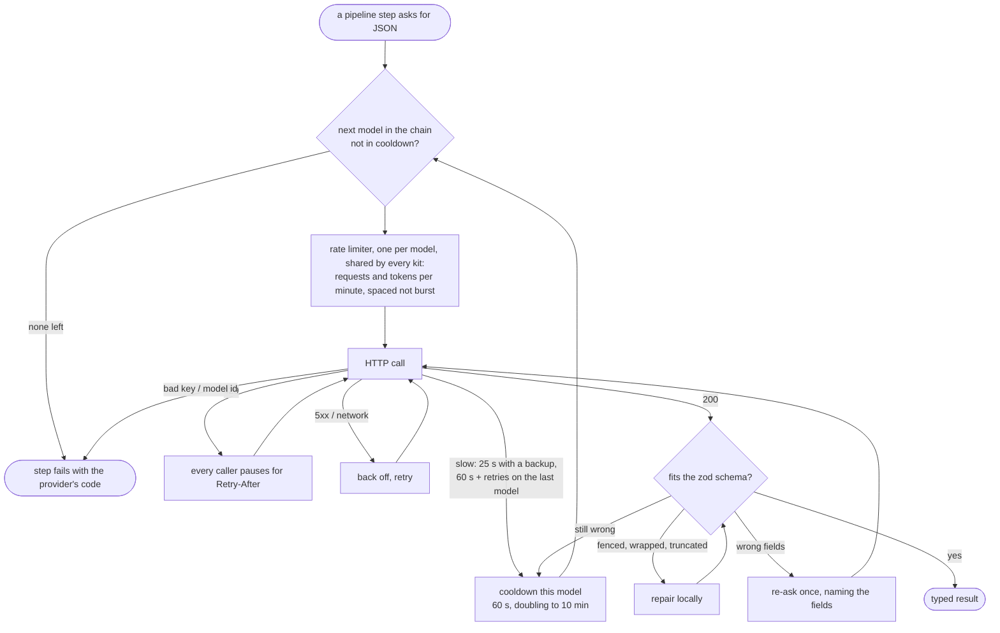
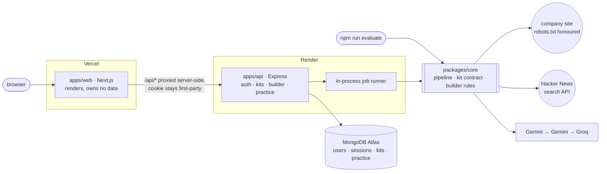
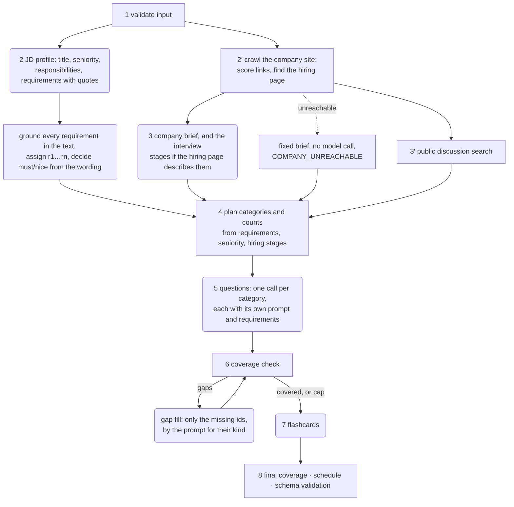
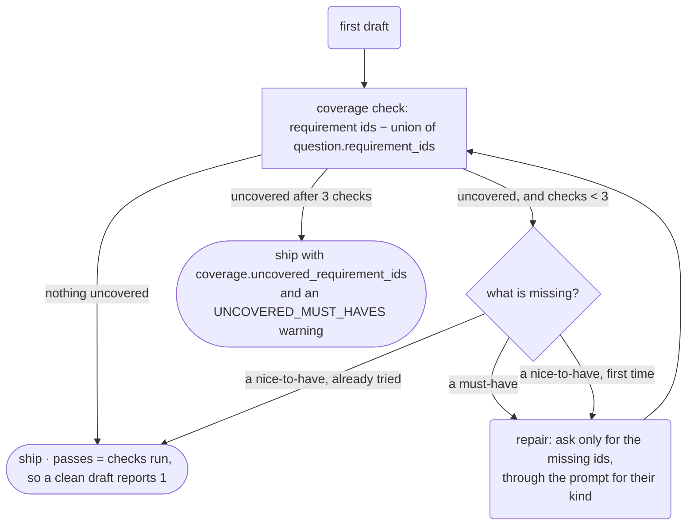
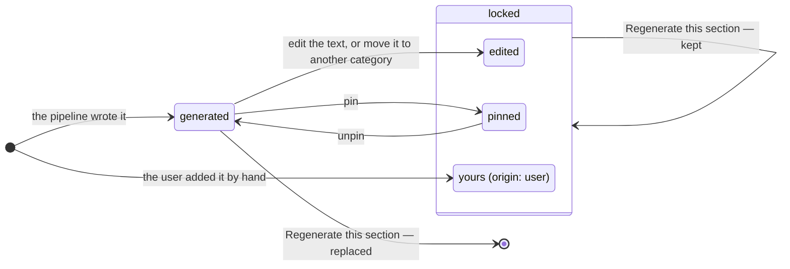
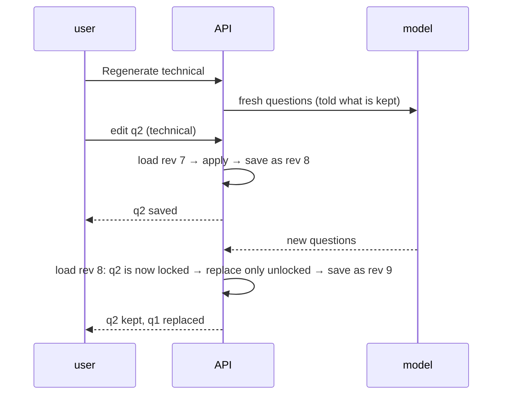
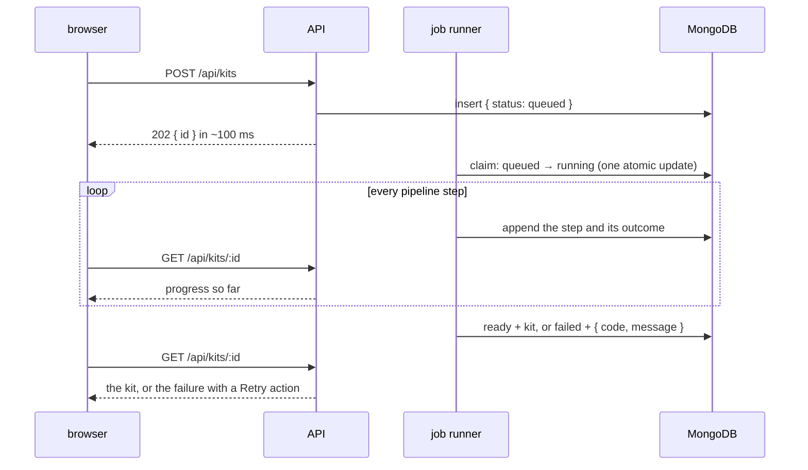

# AI Interview Prep Kit

Turns a pasted job description and a company website into an interview preparation kit: a
company brief, a role breakdown, a categorised question bank, flashcards and a day-by-day study
schedule, which the user can reshape and practise against. Built for the Trao full-stack
engineering assessment.

**Live:** [prepkit-zeta.vercel.app](https://prepkit-zeta.vercel.app) · API health at
[prepkit-api-cp9l.onrender.com/api/health](https://prepkit-api-cp9l.onrender.com/api/health).
The API sleeps when idle on its free tier; the first request of a session can take up to a minute
and the page says so while it waits.

One rule runs through the design: **the model writes prose, the code makes decisions.** Ids,
must/nice, coverage, scheduling and validation are deterministic code; the model is never asked to
do arithmetic or judge its own completeness.

- [Tech stack](#tech-stack)
- [Setup](#setup) · [batch entry point](#the-batch-entry-point) · [deployed](#deployed)
- [LLM provider and model](#llm-provider-and-model)
- [Architecture](#architecture)
- [Retrieval approach and sources](#retrieval-approach-and-sources)
- [Research and generation steps](#research-and-generation-steps)
- [Coverage: the second pass](#coverage-the-second-pass)
- [How the schedule is allocated](#how-the-schedule-is-allocated)
- [Generated, edited and pinned state](#generated-edited-and-pinned-state)
- [Long-running generation](#long-running-generation)
- [Practice mode](#practice-mode)
- [Creative feature: adaptive re-plan](#creative-feature-adaptive-re-plan)
- [Design decisions, trade-offs and known limitations](#design-decisions-trade-offs-and-known-limitations)
- [Tests](#tests)

## Tech stack

The brief's preferred stack, in TypeScript, as an npm-workspaces monorepo:

| Part | Choice |
|---|---|
| `packages/core` | The pipeline, the kit contract and the builder's rules. Plain TypeScript; [zod](https://zod.dev) for schemas. No web framework, no database |
| `apps/api` | Node.js, Express 5, MongoDB (official driver) |
| `apps/web` | Next.js 16 (App Router), Tailwind CSS v4, [shadcn/ui](https://ui.shadcn.com), TanStack Query, dnd-kit, Motion |
| Tests | vitest, fast-check for property tests |
| Hosting | Vercel (web), Render free tier (API), MongoDB Atlas M0 |

The pipeline is a library because the brief requires the batch command to run "the same code your
application uses": the API and the command line are both thin callers of `packages/core`.

## Setup

Node.js 22 or later (`.nvmrc` provided).

```bash
npm install
cp .env.example .env      # add GEMINI_API_KEY (required) and GROQ_API_KEY (optional)
npm test                  # every workspace; needs no key, network or database
npm run dev               # API on :4000 and web app on http://localhost:3000, in one terminal
```

| Variable | Where | What it is for |
|---|---|---|
| `GEMINI_API_KEY` | core, API | Google AI Studio free-tier key; runs the first two models of the chain |
| `GROQ_API_KEY` | core, API | optional; a third model from another provider as a last resort |
| `MONGODB_URI` | API | Atlas connection string with both placeholders replaced; database `prepkit` |
| `WEB_ORIGIN` | API | the web app's address; state-changing requests from any other origin are refused. Default `http://localhost:3000` |
| `API_URL` | web | where `/api/*` is forwarded. Default `http://localhost:4000`; see [`apps/web/.env.example`](apps/web/.env.example) |

### The batch entry point

```bash
npm run evaluate -- --input <cases.json> --output <kits.json>
```

Needs `npm install` and a key: no database, no server, no build. Input and output follow Appendix B.
To try it offline, serve the three fixture company sites and run the sample cases:

```bash
npm run fixtures          # in one terminal: http://localhost:8099/{acme,globex,initech}/
npm run evaluate -- --input fixtures/cases.sample.json --output kits.json
```

```
[1/5] case-01-published-process ok — 6 requirements, 17 questions, 1 pass(es), 0 warning(s)
[2/5] case-02-no-hiring-page ok — 4 requirements, 9 questions, 1 pass(es), 1 warning(s)
...
Done in 81.9s: 5 ok, 0 failed.
```

Cases run three at a time under one shared rate limiter. The output file is rewritten after every
case, so an interrupted run leaves valid output. A malformed or failing case is recorded as `failed`
and the run continues; the command exits 0 when cases fail (a failed case is a result) and 2 for
unusable arguments. `localhost` company sites are allowed here and only here.

### Deployed

| | Where | How |
|---|---|---|
| Web app | [prepkit-zeta.vercel.app](https://prepkit-zeta.vercel.app) | Vercel, root directory `apps/web`, one variable `API_URL` |
| API | [prepkit-api-cp9l.onrender.com](https://prepkit-api-cp9l.onrender.com/api/health) | Render free tier from [`render.yaml`](render.yaml); its four `sync: false` values are set in Render's dashboard |
| Database | MongoDB Atlas M0 | reached only by the API |

[`ci.yml`](.github/workflows/ci.yml) runs on every push: install, typecheck, test, lint and build.
Once it passes on `main`, two jobs deploy in parallel: one triggers Render's deploy hook, one
deploys the web app to Vercel from the build CI made. Neither host deploys on its own, so what was
tested is what goes live. The workflow needs four repository secrets: `RENDER_DEPLOY_HOOK_URL`,
`VERCEL_TOKEN`, `VERCEL_ORG_ID`, `VERCEL_PROJECT_ID`.

## LLM provider and model

Three models tried in order, all free tiers, one key required:

| # | Model | Provider | Used when |
|---|---|---|---|
| 1 | `gemini-3.5-flash-lite` | Google AI Studio | normally |
| 2 | `gemini-3.1-flash-lite` | Google AI Studio | 1 is rate-limited (Google counts quota per model, so the same key works) |
| 3 | `qwen/qwen3.8-27b` | Groq | Google itself is down or the key is refused |

Chosen by giving every candidate the same postings and checking the requirements it returned. These
three returned what the text said with must and nice told apart; the rejected ones either had a
20-request daily limit, refused free-plan access, or invented requirements (from "5+ years of
React, TypeScript required" one small model returned ten, including Redux and Webpack).

All three speak the OpenAI chat format, so there is one `fetch`-based client and no SDKs
([`llm/`](packages/core/src/llm)). Staying inside free-tier limits, which the brief calls the most
common way to lose points, is what happens to every call:



Verified against Google's own usage chart, not only in tests: a five-case batch peaks at 12
requests per minute against the limit of 15.

## Architecture



The batch command and the API are both thin callers of `@prepkit/core`; the web app shares only
its types.

**`packages/core`** is grouped by subject: `retrieval/`, `llm/`, `pipeline/`, `coverage/`,
`scheduling/`, `builder/`, `practice/`, `schema/`, `batch/`.

**`apps/api`** is routes → services → repositories, grouped by feature. Routes validate with zod and
call a service; services hold the rules; repositories touch MongoDB and decide nothing. Dependencies
are passed in as plain factory functions and assembled once in `server.ts`, which is why the API's
tests run on in-memory repositories with no database. Every error leaves in one envelope,
`{ error: { code, message, details? } }`. The kit repository has no "find by id": every method takes
the owner, and someone else's kit is a 404.

**`apps/web`** has three layers with one test for where code belongs: *can it be unit-tested
without rendering?* `src/lib/` is pure functions on the kit (what an edit does, which badge an item
gets); `src/features/` is React Query hooks (which request an edit makes, what to show before the
server answers); `src/components/` renders and owns only UI state. The browser applies every edit
optimistically, so it has its own copy of the builder's rules; a test applies each rule to the same
kit as core's and requires the same result, so the two cannot drift. The web app imports only
*types* from core (a lint rule enforces it), and the browser talks only to the web app's own origin:
`/api/*` is rewritten server-side, so the session cookie stays first-party.

[`docs/DESIGN.md`](docs/DESIGN.md) has the architecture, the data model and the design decisions
with the alternatives that were considered.

## Retrieval approach and sources

The description is pasted, so it needs no retrieval. The company site is crawled by
[`retrieval/`](packages/core/src/retrieval): a URL guard, a fetcher (deadline, size cap, redirects
re-checked, retries with backoff), a robots.txt parser, an HTML cleaner and a link scorer.

**The hiring page is found by what links say, not by a list of paths.** Anchor text carries the
most weight ("How we hire", "Careers", "Join the…"), URL words less, and noise (privacy, login,
PDFs) is penalised out. The crawl is best-first: fetch the company URL, score its links, fetch the
best, score that page's links, at most 8 pages and 3 clicks deep. In the fixture the process page
is at `/acme/handbook/join-the-crew`, reached through "Handbook" then "Join the crew". A fetched
page is then checked for named interview stages; two or more means it *describes the process*,
which changes the question mix. A careers page that only lists openings is recorded as found but
not described; a site with neither says so instead of inventing one.

**Rules.** Same origin only, and the company URL's path is a boundary because one origin may host
several companies. robots.txt is checked before every request (missing allows, unreachable
disallows, as the RFC says). Requests to a site are one second apart under an identifying
user-agent. Hidden text (comments, scripts, `display:none`, `aria-hidden`) is removed before the
model sees a page. Nothing in retrieval throws: every fetch, skip and failure is a `research_log`
entry.

**Sources used:**

| Source | For | Access |
|---|---|---|
| The company's own website | brief, hiring page, interview stages | crawled as above |
| Hacker News, via its public search API at `hn.algolia.com` | public discussion of the company's interview process | one keyless request per kit |

Nothing else is fetched. Reddit, Quora and X were checked and not used: Reddit's robots.txt
disallows everything and its search endpoint answers 403, Quora has no public route, X's read API
is paid. The HN search keeps a hit only if the company is named as a whole word next to hiring
wording ("interview process", "take-home", not the bare word "interview"), only from the last five
years, at most five, newest first, each linked and dated. Hits go to the kit's `public_discussion`
for the user to read, and only the company-fit prompt sees them, labelled as unverified.

## Research and generation steps

[`generate-kit.ts`](packages/core/src/pipeline/generate-kit.ts) runs these steps; what each does
depends on what the earlier ones found. Rounded boxes are model calls, square ones are code.



| Step | If it fails |
|---|---|
| 1 validate input (`days` 1–365; the URL is deliberately not checked, a bad one costs the research, not the kit) | `INVALID_INPUT` |
| 2 JD profile | the kit fails: nothing can be built without requirements |
| 2′ crawl · 3 brief · 3′ discussion · 7 flashcards | the kit degrades, with a warning and a `research_log` entry |
| 5 one category | that category is empty; the coverage loop regenerates it |
| 8 | never skipped |

Each kit has a 150-second budget: past it, optional model steps are skipped with a
`DEADLINE_REACHED` warning and step 8 still runs, so a late kit is a complete, valid kit. A full
kit is six or seven model calls, about fifteen seconds.

**Step 2 refuses to invent.** Every requirement must carry a quote found in the description (or
80% of its words in one line), and its wording may not add things the description never mentions;
failures are dropped and logged. Must/nice comes from the posting's own wording: an inline cue on
the line ("is a plus") wins, then the nearest heading ("Nice to have"), and only then the model's
reading. Ids `r1…rn` are assigned by code in posting order.

**Step 4 is where the kit responds to what was found.** Technical and domain requirements go to the
technical prompt; behavioural ones to a prompt that asks about past experience and never about
tools, so "5+ years of React" and "mentors juniors" are never in the same call. System-design
questions are generated for senior roles or when a design round was published; company-fit only
when the company was actually researched. Two questions per must-have, one per nice-to-have. After
each call, code stamps the category, keeps only requirement ids that were sent, and coerces
difficulty rather than spending a re-ask on it.

**Kit structure.** Every kit conforms to Appendix A
([`schema/kit.ts`](packages/core/src/schema/kit.ts)): exact field names, integer minutes, unique
ids, every reference resolving, exactly `days_available` days. A test compares parsed keys against
Appendix A's literal sample. Extensions (`warnings`, `research_log`, `hiring_process`,
`public_discussion`, `requirement_evidence`) are top-level keys only; every Appendix A object keeps
exactly its given shape.

## Coverage: the second pass

Finding gaps is a set difference, so it is code: a requirement no question lists in its
`requirement_ids` is uncovered, and an id that does not exist covers nothing.



A must-have is chased to the cap; a nice-to-have gets one attempt. Reporting a gap beats looping
until the provider rate-limits the run. A missed behavioural requirement is repaired by the
behavioural prompt, never with a technical question; a category whose call failed outright shows
up as gaps and is regenerated by the same loop. The kit's coverage is recomputed from the final
question list, never carried over.

## How the schedule is allocated

[`scheduling/schedule.ts`](packages/core/src/scheduling/schedule.ts): a pure function of
`(questions, requirements, days)`, no model.

1. **Rank** by priority × difficulty (must 3, no requirement 2, nice 1). Priority outweighs
   difficulty because it comes from the posting's wording; difficulty is the model's estimate.
2. **Minutes**: difficulty 1/2/3 → 10/15/25, so durations are integers by construction; review
   days count half; a day is capped at 480 minutes without dropping a question.
3. **At least as many questions as days**: every day gets one, the rest is shared in proportion to
   D, D−1, … 1 with largest-remainder rounding, and the ranked list is cut into those chunks. Day 1
   is heaviest and hardest; every question is scheduled exactly once.
4. **More days than questions** (60 days, a dozen questions): one new question a day in rank order,
   then review days cycling three at a time, ending on a recap of the top must-haves.
5. **No questions** (a two-line description): still exactly N days, labelled as company research.

## Generated, edited and pinned state

Rules are pure functions in [`builder/kit-editor.ts`](packages/core/src/builder/kit-editor.ts),
`(state, change) → new state`, applied by the API. Beside the kit, never inside it, each question,
flashcard and brief field carries `origin` (`generated` | `user`), `edited` and `pinned`.



**Regenerating a section replaces its unlocked items and touches nothing else**: other sections are
never read, a fresh question that repeats a kept one is dropped, and the category stays the size it
was planned, because the model is told what is kept and asked for the difference, by the same
prompt that wrote the originals. Reordering is presentation, not an edit. Ids come from counters
stored with the kit and are never reused, so the schedule and practice records can never point at
a different question. The schedule follows the questions until the user arranges it by hand, then
it is only patched (removed ids go, new questions join the lightest day); "Regenerate schedule" is
the one explicit discard. Every operation ends by recomputing coverage and re-validating the kit.

**An edit in flight.** Each kit has a revision, and a regeneration merges against the kit as it is
at merge time, not the snapshot it started from:



Two edits landing together are both kept: a save names the revision it was based on and is
refused if it moved, so the change is re-applied on the current kit. In the builder, every item
carries the badge the rule implies, each category says what Regenerate *will do* before it is
pressed ("replaces the 3 generated questions and keeps the 4 you edited, wrote or pinned"), edits
save as you type, reordering is by drag, keyboard or a per-card menu, and every change is applied
at once and sent as one small request; if it fails the page is put back and a toast says why.

## Long-running generation

Generation never runs inside a request ([`job-runner.ts`](apps/api/src/kits/job-runner.ts)):



- **Ninety seconds:** the request returned long ago; a reload or a second tab shows the same
  progress, because every step is in the record.
- **Fails halfway:** the kit is `failed` with the pipeline's own code and message, what ran is
  kept, and it can be retried under the same id.
- **Triggered twice:** a posting is fingerprinted from its normalised description and company URL
  (not days: a new interview date is the same research). A repeat answers `409 KIT_ALREADY_EXISTS`
  with the existing id and the interface offers to open it; a unique index makes a double-click
  safe. "Generate a fresh one anyway" carries an `Idempotency-Key` so the wanted repeat keeps that
  protection too.
- **The server restarts** (free hosts do): the queue is in-process, so at startup anything still
  `queued` or `running` is marked `failed` / `INTERRUPTED` with a message saying to try again.

Every failure the brief names has a stable warning code and a plain sentence in the kit's
`warnings`: `COMPANY_UNREACHABLE` (kit built from the description alone, brief written without a
model call), `NO_HIRING_PAGE`, `JD_THIN` (zero requirements, still N days), `JD_SUSPICIOUS_TEXT`
(a line addressed to an AI is flagged and treated as content), `DEADLINE_REACHED`.

**Security, briefly.** Passwords are scrypt-hashed; sessions are server-side rows holding only the
token's hash, in an `HttpOnly`, `SameSite=Lax`, `Secure` cookie; state-changing requests from
another origin are refused; login is rate-limited with the same answer and timing for a wrong
password and an unknown email. Outbound fetches reject private, loopback, link-local and metadata
addresses on every redirect hop, whether written literally, in an alternative spelling or reached
through DNS; the pasted description and every page go to the model inside data tags with
instructions to ignore what is inside, every reply must fit a schema, and code re-checks what
matters (quotes, ids, sources).

## Practice mode

The user steps through the flashcards, reveals the answer and rates it 1 forgot · 2 shaky · 3 good
· 4 easy (Space reveals, 1–4 rate, S skips). One record per user, kit and card keeps the latest
confidence and a review count, written as one atomic upsert.

The next session is a **confidence-weighted sort**, not spaced repetition: unseen cards first in
kit order, then lowest confidence, then reviewed longest ago. Interval schedulers answer "when is
this due" in days and weeks, and the interview is in a few days; "what am I worst at right now" is
the useful question, and the order stays explainable. Coverage is reported per requirement
(`no_cards`, `not_started`, `weak`, `in_progress`, `confident`), because "9 of 15 cards" says less
than "nothing on system design yet". Progress is always computed against the kit as it is now, so
a card deleted in the builder drops out.

## Creative feature: adaptive re-plan

A study plan made on day one is stale by day two, because by then the user knows what is giving
them trouble. On the Schedule tab, *Re-plan* offers "Lean toward what I found hard in practice",
on by default once any card has been rated.

It is not a second scheduler. Practice adds one factor to the existing ranking:

```
weakness(r)  = mean over r's rated cards of (4 − confidence) / 3      forgot → 1, easy → 0
emphasis(r)  = 1 if weakness ≤ that of "good", rising to 2 when every card was forgotten
weight(q)    = tier × difficulty × max emphasis over q's requirements
```

A requirement with no rated cards gets no entry: unknown is not weak. The allocation is the same
arithmetic, and a property test proves every guarantee still holds; the batch command never passes
emphasis and its output is byte-for-byte unchanged. Afterwards the schedule says what moved and by
how much in the kit's own words: in a real run, rating the two map-rendering cards "forgot" moved
three of the four map-rendering questions to the front of day one and reported
`Experience with map rendering (Mapbox or Leaflet) (×2.0)`. No model call is involved.

## Design decisions, trade-offs and known limitations

- **Pipeline as a library.** Costs a workspace boundary; buys a batch command with no database and
  no drift from the app.
- **Keyword rules decide must/nice, the hiring page and the question mix.** Deterministic,
  explainable, free, and English-only.
- **Grounding drops rather than re-asks.** A heavily paraphrased real requirement could be lost;
  chosen because inventing is penalised more than missing and calls are scarce.
- **Coverage trusts `requirement_ids`.** It proves every requirement has a question pointing at
  it, not that the question is good.
- **Same-origin crawl.** An external applicant-tracking site or a `careers.` subdomain is not
  followed; `sitemap.xml` is not used.
- **Public discussion from Hacker News only**, and a company with a generic name gets generic
  results, labelled and kept away from anything stated as fact.
- **Server-side sessions, not JWTs.** Logout is a deletion; the cost is one indexed read per
  request.
- **MongoDB driver with zod, not an ODM.** The kit's shape is already a zod schema; a second
  schema system would drift.
- **In-memory repositories in tests.** Tests pass from a clean clone with no 100 MB binary
  download; the MongoDB repositories are kept thin and were verified against Atlas by hand.
- **Whole-kit saves guarded by a revision**, not field-level updates: the rules stay pure functions
  over a whole kit; the cost is a document rewrite per change, nothing at these sizes.
- **In-process queue and login limiter.** With more than one instance both would need a shared
  store.
- **Models 1 and 2 share a provider.** Only Groq covers a Google outage, and its 8K tokens per
  minute carry a few kits, not a full batch.
- **DNS rebinding.** The URL guard validates what DNS returns, then the connection resolves again;
  pinning the socket to the validated address was left out.

## Tests

```bash
npm test          # core 556 · api 191 · web 116, no key, network or database
```

- **Core:** kit and batch structure validation including Appendix A key conformance; coverage and
  the pass limit; schedule allocation for 1, N, 60 and zero-question cases, plus a property test
  over random kits and day counts. Retrieval runs against real local HTTP servers, including a
  fixture hosting three companies under one origin the way the brief serves its sites. The pipeline
  runs end to end against a scripted model that answers by step, so a model that invents
  requirements, forgets a must-have or 429s on one category is reproducible.
- **API:** supertest over HTTP against the real Express app on in-memory repositories: the error
  envelope, authentication, duplicates and double-clicks, progress and retry, ownership on every
  route, practice, and the builder including two simultaneous edits and an edit during a
  regeneration. Mutation-checked: unlocking edited items fails seven tests.
- **Web:** the pure layers without a browser, including the agreement tests that the browser's
  optimistic edit rules give the same kit as core's.
- **By hand:** every screen was driven in a real browser (headless Chrome over the DevTools
  protocol, real keys, clicks and drags) against the deployed stack, and the MongoDB repositories
  against a real Atlas cluster. Each pipeline step was run against the real models before commit;
  that is what caught flashcards quizzing the posting instead of teaching the subject.
