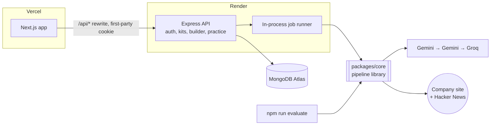
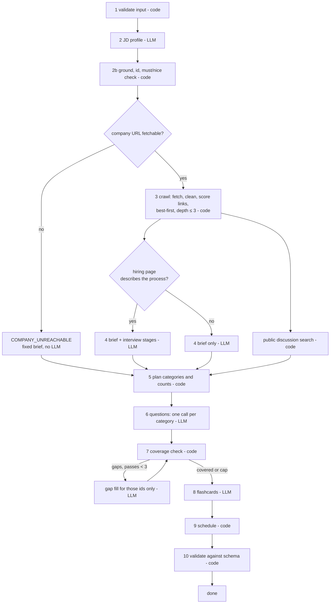

# System design

How the system is put together and why. The [README](../README.md) covers setup, the generation
steps in detail and the reasoning the brief asks for; this file holds the architecture, the data
model and the design decisions with the alternatives that were considered.

Guiding rule: **the model writes prose, the code makes decisions.** Ids, must/nice, coverage,
scheduling, merging and validation are deterministic code.

## 1. Architecture



| Component | Responsibility | Does not |
|---|---|---|
| `packages/core` | retrieval, extraction, generation, coverage, scheduling, the kit contract, the builder's merge rules | import a web framework or a database driver |
| `apps/api` | accounts and sessions, ownership, persistence, the job runner, HTTP validation and the error envelope | make pipeline or scheduling decisions |
| `apps/web` | rendering, optimistic edits, UI state | hold data of its own, or import core's code (types only) |
| `npm run evaluate` | the batch entry point: file in, file out | need a server or a database |

The pipeline is a library with no database in it because the batch command must run the same code
as the application with no setup beyond install. The API injects persistence and a progress
callback; the command line injects a file writer.

## 2. The pipeline

An explicit orchestrator whose branches depend on what earlier steps found. Every step emits a
progress event and appends to `research_log`.



## 3. Data model

The kit itself is Appendix A, dictated by the brief. What was designed is the document around it,
which is what lets a kit be reopened mid-generation, edited without losing the user's work, and
regenerated without clobbering it:

```ts
// kits — one document per kit
{
  id, userId,
  input: { description, companyUrl, days },
  fingerprint,                       // normalised description + company URL; unique per user
  status: "queued" | "running" | "ready" | "failed",
  progress: ProgressEvent[],         // every pipeline step so far; a reload redraws from this
  error: { code, message } | null,
  kit: Kit | null,                   // Appendix A, exactly
  meta: {                            // beside the kit, never inside it
    items: Record<"q7" | "f3" | "brief.summary", { origin: "generated" | "user", edited, pinned }>,
    nextQuestion, nextFlashcard,     // ids are never reused
    scheduleEdited,                  // once arranged by hand the schedule is patched, not rebuilt
  } | null,
  rev,                               // +1 on every save; a save names the rev it was based on
  createdAt, updatedAt,
}
```

`meta.items` is the answer to the brief's generated / edited / pinned question: an item is locked
when its origin is `user`, or it is edited, or pinned, and a regeneration replaces only unlocked
items. Keeping it beside the kit means every Appendix A object stays exactly the shape the brief
gives it.

| Collection | Holds | Keys |
|---|---|---|
| `users` | email, password hash | unique email |
| `sessions` | token hash, user, expiry | unique token hash; TTL on expiry |
| `kits` | as above | `(user, fingerprint)` unique |
| `practice` | `{ userId, kitId, cardId, confidence, reps, reviewedAt }` | `(user, kit, card)` unique |

## 4. Design decisions

| Decision | Alternative considered | Why |
|---|---|---|
| A case is `ok` whenever a kit was produced, including one built from the description alone because the site was unreachable | `failed` on an unreachable site, as Appendix B's sample row suggests | The FAQ is normative: "reserve failed for a case you could not produce a kit for at all". The gap goes in `warnings` |
| Whether private addresses may be fetched is an argument the caller passes in code (`true` from the batch command, `false` from the production API) | an environment variable | The brief rejects loopback in production and also serves its test sites from `localhost`; a flag could be forgotten or mis-set, an argument cannot |
| The crawl stays on the seed URL's origin, and its path (`/acme/`) is a hard boundary | follow any link on the origin | One origin may host several companies; adopting a neighbour's careers page would be fabricated research |
| Provenance beside the kit, not inside it | `origin`/`edited` fields on each question | Every Appendix A object keeps exactly its given shape for the evaluator |
| Whole-kit saves guarded by a revision number, with reload-and-reapply on conflict | item-level database writes with no concurrency layer | The builder's rules stay pure functions over a whole kit, which keeps them testable and the kit valid after every change; the cost is a document rewrite per change, nothing at these sizes |
| A regeneration merges against the kit as it is at merge time | merge against the snapshot the job started from | An edit made while the model was thinking has, by then, simply locked that item |
| Progress by polling the persisted step log | server-sent events | Survives proxies, cold starts and a reload; the step log has to be persisted anyway |
| An in-process job queue | a worker and a broker | Two more free-tier services to keep alive; the cost, no survival across restarts, is handled by marking interrupted jobs at startup |
| scrypt from Node's `crypto` | argon2 | No native add-on to build on a free host; parameters are stored in the hash so they can be raised later |
| Server-side sessions | JWTs | Logout must revoke at once; with a stateless token that needs a denylist anyway |
| Grounding drops an unquoted requirement | re-ask the model for a better quote | Inventing is penalised more than missing, and calls are scarce on a free tier |
| A confidence-weighted sort for practice order | spaced repetition (SM-2) | Intervals are measured in days and weeks; the interview is in days. "What am I worst at now" is the useful question, and the order stays explainable |
