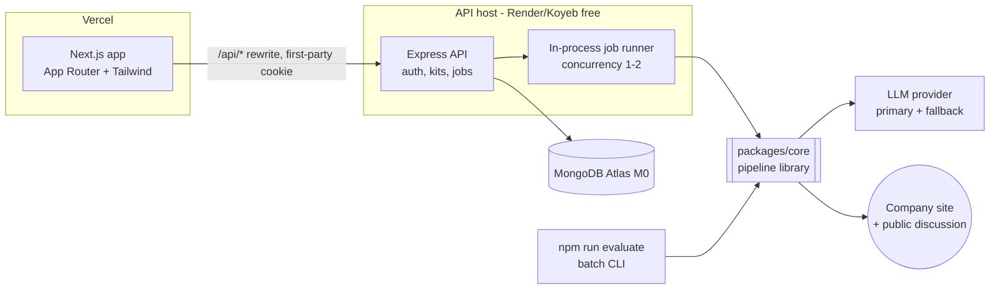
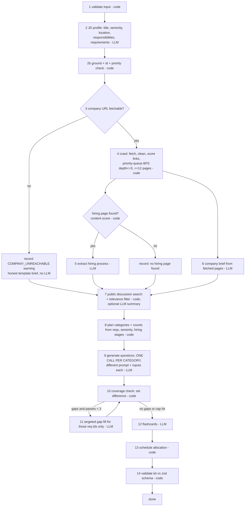

# AI Interview Prep Kit — System Design

Working design for the Trao assessment. Sections map onto what the README must explain, so this
file becomes the README's backbone later. Section refs like (§9) point at the brief.

Guiding rule, straight from the brief: **the model writes prose, the code makes decisions.**
IDs, priorities' final say, coverage, scheduling, merging, validation and status are all code.

---

## 1. System topology



Repo layout (npm workspaces, TypeScript everywhere):

```
packages/core     pipeline: retrieval/ extraction/ generation/ scheduling/ coverage/ schema/ llm/
                  NO Express, NO Mongo, NO Next imports. Pure library + CLI.
apps/api          Express: auth, kit CRUD, job runner, persistence (the only place Mongo lives)
apps/web          Next.js UI
fixtures/         local fake company sites + sample cases.json for tests and dry runs
```

Why this shape: §9 demands the batch command run "the same code your application uses, not a
parallel implementation" and need "no setup beyond your documented install step". So the pipeline
must be a library that needs **no database**; the API injects persistence and progress callbacks,
the CLI injects a file writer. `npm run evaluate` runs through `tsx` — no build step to forget.

---

## 2. The pipeline (packages/core)

An explicit orchestrator (plain async state machine, not an agent framework) whose branches depend
on what earlier steps found. Every step emits a progress event and appends to a `research_log`.



| Step | Owner | Notes |
|---|---|---|
| JD profile | LLM, temp 0 | One call returns `role.title`, `seniority`, `location`, `responsibilities[]`, `requirements[]`. Absent fields stay `""` — never guessed. Each requirement must carry an `evidence` quote |
| Grounding | code | Normalise both sides (NFKC, lowercase, quotes/dashes/bullets, whitespace), then require >= 0.8 token containment of the evidence in the JD. On failure: one re-ask for the exact span, drop only if that fails too, and log the drop. Guards "nothing invented" without deleting paraphrased must-haves — both live in the same 20-pt bucket |
| `source.*` | code | `jd_chars`, `researched_at`, `pages_used`, `company_brief.sources` come from the input and fetch log. `company` from the site's `og:site_name` / `<title>`, falling back to the JD — never from the hostname (it may be `localhost`) |
| Requirement ids | code | `r1..rn` in JD order. The model never invents ids |
| must / nice | LLM proposes, code cross-checks | Deterministic override from heading context ("Nice to have", "Bonus", "Preferred") and cue words ("required", "must", "plus", "ideally") |
| Link ranking | code | Score = anchor text + URL tokens + nav position + depth. Anchor text matters more than path — paths "cannot be hard-coded" (§2). Also try `sitemap.xml` |
| Hiring-page confirmation | code | Judge the fetched *content* (interview, stages, take-home, offer...) not the URL |
| Category plan | code | Hiring stages shift weights: published take-home + system design round => more system-design questions. Nothing found => balanced default, and the brief says so |
| Question generation | LLM | Per category: technical <- technical/domain reqs; behavioural <- behavioural reqs; system-design <- seniority + stack + hiring stages; company-fit <- brief. Category with no inputs is **skipped**, not padded |
| Question ids / requirement_ids | code | Ids assigned by code; any `requirement_ids` not in the supplied set are stripped. A technical/behavioural question left with none is discarded; company-fit and system-design questions may legitimately map to no JD requirement |
| Coverage | code | `all req ids - union(question.requirement_ids)`. Musts are blocking, nices best-effort. `coverage.passes` = number of coverage checks run (a clean first draft is `1`) |
| Dedupe | code | Near-identical prompts across categories (normalised token similarity) collapse to one question, keeping the union of `requirement_ids` |
| Schedule | code | §5 below |

**Pass policy (§4):** 1 draft + up to 2 repair passes. Stop as soon as uncovered musts = 0. Each
repair only asks for the missing requirement ids, so it is cheap and converges. If the cap is hit,
ship with `coverage.uncovered_requirement_ids` populated honestly rather than looping forever.
Bonus: a category call that failed outright is healed by the same loop — the gap check *is* the
recovery path.

**Failure policy per step**

| Step fails | Effect |
|---|---|
| Input invalid (empty JD, days not a positive int) | case `failed` / 400 `INVALID_INPUT` |
| Requirement extraction after retries | case `failed` `LLM_UNAVAILABLE` — nothing to build on |
| Company site / a page / robots-disallowed / search | skip, log in `research_log`, continue — status stays `ok` |
| Brief / one category / flashcards | degrade, record warning, continue |
| Final kit fails schema | coerce in code (clamp `difficulty` 1-3, drop unparseable items, re-run coverage + schedule) and ship `ok` with a warning. `failed` `INVALID_KIT` only if it still cannot validate |

**Status rule (decided):** `ok` whenever a kit object was produced — including JD-only kits for
unreachable or invalid company URLs, with the gap in `warnings` and an honest brief. The FAQ is
normative ("Reserve failed for a case you could not produce a kit for at all"); Appendix B's
`COMPANY_UNREACHABLE` row is read as illustrating the error shape. `failed` = unusable input or
the LLM being unavailable for the JD profile step.

**Schema contract:** Appendix A and the Appendix B envelope (`version: "1.0"`, `generated_at`,
`kits[]` with `id/status/kit/error`) are transcribed literally into `packages/core/src/schema`,
with a golden test that parses the Appendix A sample verbatim.

**Kit extensions** (allowed by §5) are **top-level keys only**, so every Appendix A object keeps
exactly its given shape: `research_log[]` (`{step, url, outcome, reason}` — proves "hiring page
sought", "public discussion searched", "unreachable recorded"), `warnings[]`, `hiring_process`
(`found`, `stages[]`, `source`), `requirement_evidence` (`{r1: "quote"}`). UI-only state
(provenance, id counters) lives on the Mongo document, not in the emitted kit.

---

## 3. Retrieval, safety and the LLM layer

### Fetcher (one function, everything goes through it)
- URL validation: http/https only, no credentials in URL, resolve DNS, reject private / loopback /
  link-local / metadata ranges, re-validate on every redirect hop (max 3). Socket-level IP pinning
  against DNS rebinding is a named limitation, not built.
- The localhost problem: §11 says reject loopback *in production*, but §9/Appendix B feeds
  `http://localhost:8099/acme/`. Resolution: the fetcher takes an `allowPrivateHosts` option set
  **by the caller in code, not by env**. The CLI is a local operator tool and always passes `true`
  — the grader cannot misconfigure it. The API passes `NODE_ENV !== 'production'`.
- Limits: 10 s timeout, 1.5 MB body cap (stream and abort), `text/html` / `text/plain` only.
- Politeness: robots.txt per origin (missing robots = allowed), 1 req/s per host (loopback hosts
  exempt — five fixture companies share one origin), exponential backoff with jitter on 429/5xx,
  max 3 attempts, then skip-and-record.
- Relative links: always `new URL(href, pageUrl)`. Crawl scope = same origin, and when the seed
  URL has a non-root path (`/acme/`) that prefix is a **hard boundary** — a shared fixture origin
  hosts other companies, and folding their careers page into this kit would be fabricated
  research. Only if nothing hiring-related is found inside the prefix may out-of-prefix links *seen
  on the company's own pages* be fetched: one hop, never expanded further.

### Cleaner
Strip `script/style/nav/footer`, HTML comments, and hidden elements (`display:none`, `hidden`,
`aria-hidden`, zero-size) — hidden text is where injected instructions live. Collapse to text,
truncate to ~6k chars per page, keep top 3-5 pages by score.

### Prompt-injection stance (§11)
- Untrusted text goes only inside delimited data blocks; system prompt states it is data.
- Every LLM output is schema-validated; the model has no tools and can trigger no actions.
- Evidence grounding kills invented requirements. Lines that look addressed to an AI ("ignore
  previous", "as an AI") are logged as a warning but **never excluded** — a regex deleting real JD
  lines would cost more than it saves.
- Later steps receive the structured requirement list, not the raw JD/page, which limits blast radius.

### Public discussion
Keyless so a clean clone works: HN Algolia search API only. Hits must mention the company name
(derived as in §2, never the hostname) *and* interview terms; otherwise the kit
says nothing was found. Common/fictional names ("Acme") will produce junk — the relevance filter
and an honest "nothing found" matter more than recall.

### LLM layer
- `LlmProvider.complete({system, user, schema})` interface with **one** real provider to start
  (shortlist: Gemini Flash free tier for schema-constrained JSON) plus a fake provider for tests.
  A second provider is a day-4 add if time remains; the interface keeps that cheap.
  **Check current free-tier RPM/TPM on day 1 and put them in config — do not trust remembered numbers.**
- Global limiter shared by every job: token bucket on requests/min **and** tokens/min
  (estimate chars/4 + max output). Honour `Retry-After`. 429 => backoff, then fail over.
- Invalid JSON: parse -> `jsonrepair` -> one re-ask including the validation error -> step failure.
- Budget: ~9-11 calls per case, pages truncated, JD sent once (to extraction only).
  Five cases in 15 min (§9): batch runs cases at concurrency 3 — the shared limiter, not
  sequencing, is what respects RPM/TPM. Each case has a **hard** 150 s deadline: at the buzzer the
  orchestrator stops starting LLM steps, runs the code-only tail (coverage, schedule, validate)
  and emits the best kit it has, with a warning. Time the real 5-case batch at build step 5.

---

## 4. Generated / edited / pinned state (the hardest problem, §6)

Provenance lives in a sibling map on the Mongo kit document, keyed by item id or brief field name
— never inline, so `company_brief.summary` stays a string and every item keeps Appendix A's shape:

```ts
item_meta: Record<string /* 'q7' | 'f3' | 'brief.summary' */, 
  { origin: 'generated' | 'user', edited: boolean, pinned: boolean, run: string, updated_at: string }>
```

- **Locked** = `origin === 'user' || edited || pinned`. Any manual text edit or category move sets
  `edited`. Pin is the explicit "keep this" for untouched generated items.
- **Regenerate category X**: replace only unlocked items in X. Locked items are passed to the
  prompt as "already present, do not duplicate". Other sections are never touched.
- **Ids are never reused**: the kit stores `next_question_id` / `next_flashcard_id` counters. New
  items get fresh ids, so schedule and practice references can never alias a different question.
- **After a regenerate (code, no LLM)**: purge removed ids from `schedule` and practice records,
  re-run coverage, gap-fill if a must lost its only question, then schedule — recomputed if the
  user never edited it, minimally patched (dead ids out, new ids into lightest days) if they did.
- **Brief**: field-level flags; regenerate only rewrites unedited fields.
- **Explicit "Regenerate schedule"** is different from the patch above: it is a full recompute,
  behind a "this discards your schedule edits" confirm.
- **Edits in flight**: the locked set is computed *at write time against the current document*,
  not the snapshot the job started from, and the write removes only ids that are unlocked right
  then. With item-level writes that is enough — no optimistic-concurrency layer. An edit made
  during a 40-second regeneration therefore survives.
- **API granularity**: item-level PATCH/POST/DELETE and a reorder endpoint taking an ordered id
  list — never whole-kit PUT, which is how work gets clobbered.

---

## 5. Schedule allocation (pure function, §8)

`schedule(questions, requirements, days) -> days[]`

1. Minutes per question from difficulty: `{1: 10, 2: 15, 3: 25}` — integers by construction.
2. Weight = priority (must 3, nice 1; max over linked reqs) x difficulty. Sort descending.
3. Day capacities decay linearly, so early days carry more and the last day is light review.
4. `questions >= days`: fill days in sorted order against capacity; no empty days.
   A day's minutes are capped (480); over the cap, every id stays and minutes scale down to fit.
5. `questions < days` (the 60-day case): new material on the first days, remaining days become
   review days cycling questions by weight, ending with a must-have review.
6. 1 day: everything in day 1, musts first.
7. `focus` is derived in code from the day's dominant category/requirements.
8. Zero questions (stub JD): still exactly N days, empty `question_ids`, focus on company research.

Invariants, enforced by property-based tests (fast-check). Unconditional: `days.length ===
days_available`; day numbers 1..N; every `question_id` exists; minutes are positive integers.
When there is at least one question: every question scheduled at least once; every must
requirement that has a question is reachable via a scheduled one; no empty days; average weight
trends downward over the first-exposure days.

---

## 6. Backend (apps/api)

- **Auth**: argon2 hashes; server-side sessions in Mongo; httpOnly, Secure, SameSite=Lax cookie.
  Revocable logout, simple expiry. Login rate-limited. Origin check on mutations.
- **Ownership**: every query is `{_id, userId}`; foreign kits return 404.
- **Cookie across hosts**: web on Vercel + API elsewhere = third-party cookie, which browsers
  block. Next.js rewrites `/api/*` to the API host so the cookie is first-party.
- **Creating a kit**: `POST /kits` validates (zod), computes
  `fingerprint = sha256(normalised JD + normalised URL)`, inserts kit `queued`, returns 202.
  A unique index on `{userId, fingerprint}` makes double-submit atomic: the second request gets
  409 with the existing kit's id and the UI opens it (with a "generate fresh anyway" override).
- **Multi-role upload**: JSON/CSV of `{jd, company_url, days}` -> N kits queued, per-row validation
  errors returned up front.
- **Job runner**: in-process queue, concurrency 1-2, shared LLM limiter. Each step persists its
  output and a progress event on the kit doc, so a page refresh resumes the view. On boot, jobs
  stuck in `running` are marked `INTERRUPTED` with a retry action (free hosts restart).
- **Progress transport**: poll the persisted step log every ~1.5 s first (robust through proxies
  and cold starts); upgrade to SSE only if time remains.
- **Errors**: one envelope `{error: {code, message, details?}}`; stable codes drive UI states.

Collections: `users`, `sessions`, `kits` (kit body + `item_meta` + id counters + job state),
`practice` (`{userId, kitId, cardId, confidence, reviewedAt, reps}`, unique on the first three).

Cold start: the web app pings `/api/health` on load and shows "waking the server" until it answers,
so the first login does not hit a proxy timeout.

---

## 7. Frontend (apps/web)

Routes: `/login` `/register` `/kits` (list + empty state) `/kits/new` (paste / upload)
`/kits/[id]` (builder: Brief, Role, Questions, Flashcards, Schedule) `/kits/[id]/practice`.

- **Generation view**: step timeline fed by the step log — done / running / skipped-with-reason /
  failed. Partial results render as they land. Failure states name the cause and offer retry.
  The user can navigate away and come back.
- **State boundaries**: TanStack Query owns server state; each editor owns its draft while focused.
  Debounced autosave (~500 ms) with optimistic update and rollback + toast on failure. A refetch or
  regenerate result merges by id and **skips dirty/focused fields**.
- **Reorder / move**: dnd-kit with keyboard sensor, plus explicit "Move up / down / to category"
  menu — that is what makes it usable on a phone and by keyboard (§12).
- **Regenerate UX**: per-section button, shows "N items locked and will be kept", section-level
  spinner only; rest of the kit stays editable.
- **Item badges**: generated / edited / yours / pinned, so the merge rules are visible.
- **Session expiry**: 401 interceptor -> login with return URL; unsaved draft parked in
  localStorage and restored.
- **Practice**: one card at a time, reveal (Space), rate 1-4 (number keys). Coverage panel by
  requirement. Next-session order: unseen first, then lowest confidence, ties by oldest review.
  Defence: the prep window is days, so SM-2 intervals mostly land after the interview;
  confidence-weighted ordering fits the horizon.
- **Creative feature (proposal)**: *Adaptive re-plan* — feed practice confidence and days remaining
  back into the deterministic scheduler to re-allocate the remaining days toward weak
  requirements. Real problem (plans go stale by day 2), nearly free because scheduling is code.

---

## 8. Batch entry point (§9)

`npm run evaluate -- --input cases.json --output kits.json`

- Same `runPipeline()` as the API; no Mongo, no server.
- try/catch per case; **every input id gets an entry** even on crash; exit code 0 with failures recorded.
- Output rewritten atomically after each case, so a hard timeout still leaves valid partial output.
- Writes the Appendix B envelope exactly: `version: "1.0"`, `generated_at`, `kits[]` of
  `{id, status, kit, error}`.
- In-run memo by fingerprint covers **research + questions only**; `schedule()` always re-runs
  with that case's `days`, so two cases differing only in `days` get different schedules.
- Loads `.env` itself (`dotenv`), so "copy `.env.example`, add a key" works from a clean clone.
- Missing API key => each case `failed` `LLM_NOT_CONFIGURED` with a clear message, not a stack trace.
- `.nvmrc` + `engines`; lockfile committed; dry-run from a fresh `git clone` before submitting.

---

## 9. Caveats and open decisions

1. **Unreachable site => `ok`, decided** (see Status rule in §2). Appendix B's sample row and the
   FAQ pull in different directions; the FAQ is the normative text. One README paragraph defends it.
2. **Free-tier limits move.** Limits in config, two providers, test the full 5-case batch early.
3. **Domain requirements have no matching question category.** `kind` has `domain`; `category`
   does not. Plan: domain reqs feed the technical prompt with a domain framing.
4. **Coverage is only as honest as `requirement_ids`.** A model can tag a question with a req it
   does not address. Cheap lexical overlap check as a sanity guard; limitation noted in README.
5. **Free API hosts sleep.** First request can take ~50 s. UI needs a "waking the server" state.
6. **In-process queue** is single-instance only. Fine here; named as a known limitation.
7. **Public discussion is thin** without paid search and for small companies. Honest-empty is the
   expected common case.
8. **robots.txt may be part of the test.** A disallowed hiring page must be skipped and recorded.
9. **Tests must run with no API key and no database** — fake LLM provider + local fixture server.
10. **Commit history is graded.** Small commits in build order, not one dump at the end.

## 10. Build order

1. Kit zod schema + validators + tests
2. Scheduler + coverage checker + property tests
3. Fetcher / cleaner / link scorer + fixture sites (odd hiring path, no hiring page, 404, timeout,
   injection page, oversized page, non-HTML, robots-disallow, relative links under a base path)
4. LLM layer (limiter, repair, fake provider) + pipeline steps + orchestrator
5. `evaluate` CLI — run the 5-case batch against fixtures, time it
6. API: auth, kits, job runner, progress
7. Builder UI + provenance merge
8. Practice mode, adaptive re-plan
9. Deploy, README, video
